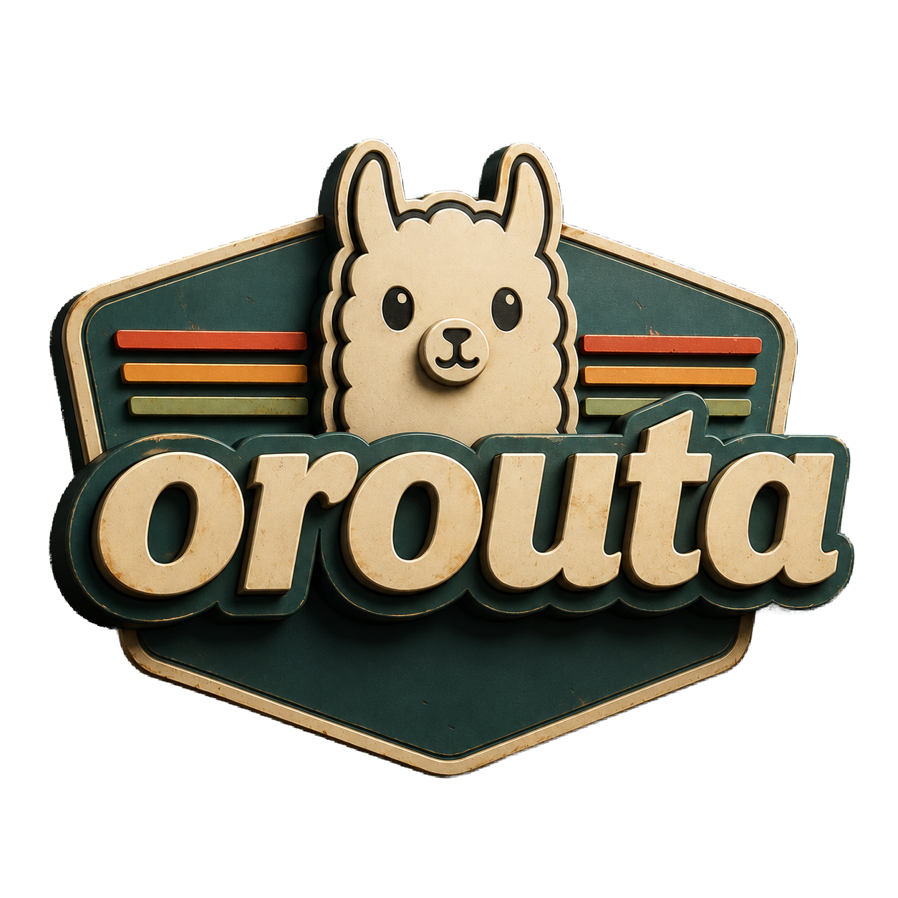

# orouta

<p align="center">
  
</p>

Several Ollama hosts behind one port. orouta asks each host `/api/tags`. The JSON `model` (or `name`) picks the host. Anthropic `POST /v1/messages` is translated to Ollama `/api/chat`; everything else is byte-forwarded.

## Install

```
curl -fsSL https://orouta.dev/install.sh | sh
```

Puts `orouta` in `~/.local/bin` (override with `OROUTA_BINDIR`). Fetches the latest GitHub release binary for this OS/arch. Pin with `OROUTA_VERSION=v0.1.0`.

## Run

```
cp orouta.toml.example orouta.toml
orouta --config orouta.toml
```

From source:

```
cargo run --release -- --config orouta.toml
```

Default listen is `host = "0.0.0.0"` and `port = 11434`. `--config` defaults to `orouta.toml`.

## Config

See `orouta.toml.example`. Logo: `docs/logo.png`. Favicons: `docs/favicons/`.

- List Ollama hosts under `[[upstream]]`. orouta asks each `/api/tags` and routes by `model` or `name`. A name should live on one host. `llama3` matches `llama3:latest`. Unknown names are 404.
- Remote Ollama must listen on `0.0.0.0`. Loopback-only Ollama is unreachable on a LAN IP. See [Expose Ollama](https://orouta.dev/docs/ollama-host/).
- `auth.keys` empty: no client auth. Non-empty: `Authorization: Bearer` or `x-api-key` must match.
- Upstream `api_key`, if set, is sent as `Authorization: Bearer` to that host. Client auth headers are stripped.

## Examples

```
curl -H "Authorization: Bearer sk-orouta-alice" http://127.0.0.1:11434/api/tags

curl -H "Authorization: Bearer sk-orouta-alice" \
  -H "Content-Type: application/json" \
  -d '{"model":"llama3","messages":[{"role":"user","content":"hi"}]}' \
  http://127.0.0.1:11434/api/chat

curl -H "x-api-key: sk-orouta-alice" \
  -H "Content-Type: application/json" \
  -d '{"model":"claude-sonnet","max_tokens":64,"system":"be brief","messages":[{"role":"user","content":"hi"}]}' \
  http://127.0.0.1:11434/v1/messages
```
